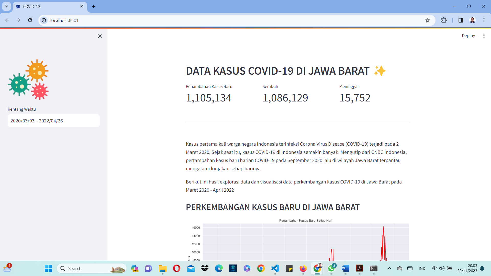
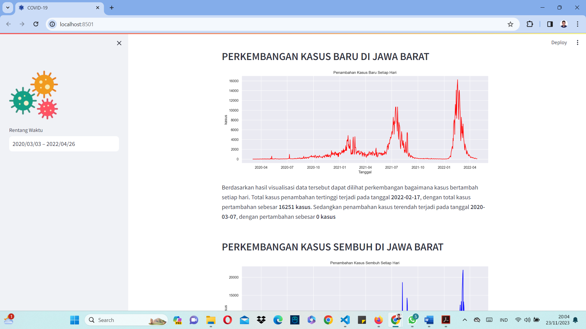
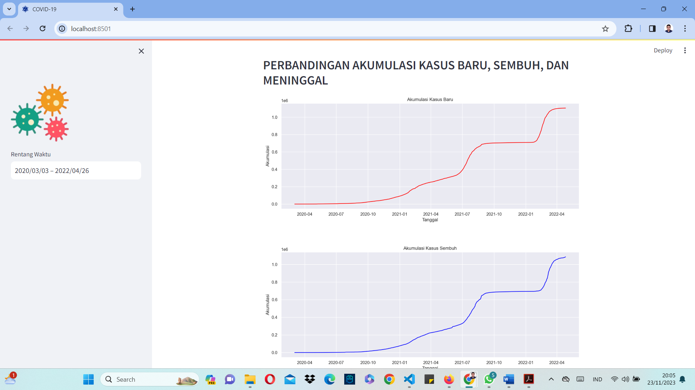

# ANALISIS PERKEMBANGAN COVID-19 DI JAWA BARAT

Analisis perkembagan COVID-19 di jawa barat merupakan latihan mandiri yang saya lakukan. Pada projek ini saya menganalisis dan mengembangkan dashboard dari sebuah dataset. Dataset yang saya analisis dapat dilihat pada link berikut : [KLIK DISINI][https://storage.googleapis.com/dqlab-dataset/prov_detail_JAWA_BARAT.json]

## Mulai Bekerja

1. Kloning Repositori Ini

```
https://github.com/iqbalpurba26/Analisis-Perkembangan-COVID-19-Jawa-Barat.git
```

2. Persiapan Lingkungan

```
conda create --name main-ds python=3.10
conda activate main-ds
pip install pandas matplotlib seaborn streamlit
```

3. Jalankan Aplikasi Streamlit

```
streamlit run dashboard.py
```

## Screenshot Tampilan







